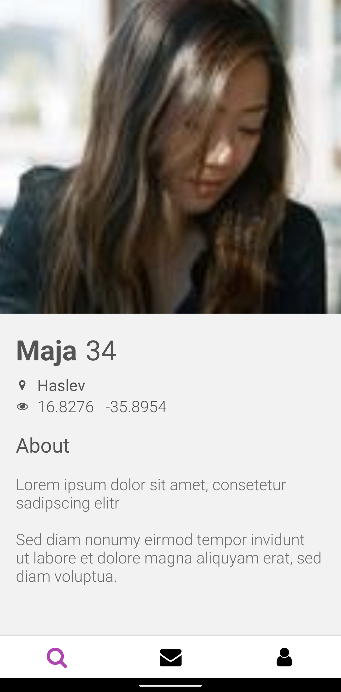
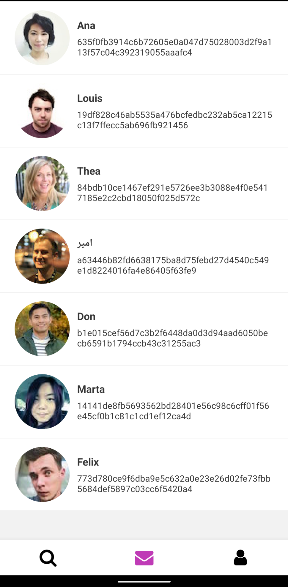
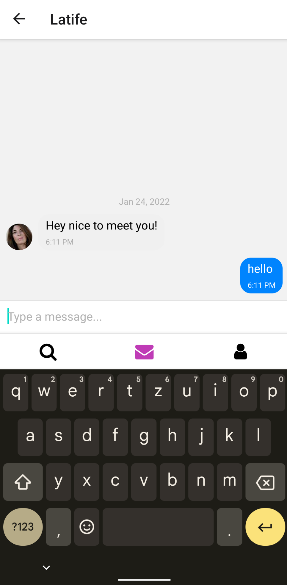

<div id="top"></div>
<!--
*** Thanks for checking out the Best-README-Template. If you have a suggestion
*** that would make this better, please fork the repo and create a pull request
*** or simply open an issue with the tag "enhancement".
*** Don't forget to give the project a star!
*** Thanks again! Now go create something AMAZING! :D
-->


<!-- PROJECT SHIELDS -->
<!--
*** I'm using markdown "reference style" links for readability.
*** Reference links are enclosed in brackets [ ] instead of parentheses ( ).
*** See the bottom of this document for the declaration of the reference variables
*** for contributors-url, forks-url, etc. This is an optional, concise syntax you may use.
*** https://www.markdownguide.org/basic-syntax/#reference-style-links
-->


<!-- PROJECT LOGO -->
<br />
<div align="center">
  

<h3 align="center">React Native Dating App</h3>

  <p align="center">
    This app allows a user to see generated people, the users active chats, and the chat view with all messages.<br>Users can tap on profiles to see details for a person or enter the chat view through the messages overview.
    <br />
    <br />
    <a href="https://github.com/romankupkovic/reactnative_test/blob/master/assets/lyla_demo.mp4">View Demo File</a><br>
    <a href="https://youtu.be/bvbhYfPdPrk">View Demo on YouTube</a>
  </p>
</div>


<!-- TABLE OF CONTENTS -->
<details>
  <summary>Table of Contents</summary>
  <ol>
    <li>
      <a href="#about-the-project">About The Project</a>
      <ul>
        <li><a href="#built-with">Built With</a></li>
      </ul>
    </li>
    <li>
      <a href="#getting-started">Getting Started</a>
      <ul>
        <li><a href="#prerequisites">Prerequisites</a></li>
        <li><a href="#installation">Installation</a></li>
      </ul>
    </li>
    <li><a href="#usage">Usage</a></li>
  </ol>
</details>


<!-- ABOUT THE PROJECT -->
## About The Project
<div align="center">
    <a href="https://github.com/romankupkovic/reactnative_test/blob/master/assets/lylaresultstab.png">
        
    </a>
    <a href="https://github.com/romankupkovic/reactnative_test/blob/master/assets/lylaprofileview.png">
        
    </a> 
    <a href="https://github.com/romankupkovic/reactnative_test/blob/master/assets/lylamessagetab.png">
        
    </a>
    <a href="https://github.com/romankupkovic/reactnative_test/blob/master/assets/lylachatview.png">
        
    </a>
</div>

<p align="right">(<a href="#top">back to top</a>)</p>


### Built With

* [React Native](https://reactnative.dev/)
* [Expo](https://expo.dev/)


<p align="right">(<a href="#top">back to top</a>)</p>


<!-- GETTING STARTED -->
## Getting Started


### Prerequisites

To run this application Node.js is required
* Linux
  ```sh
  sudo apt install nodejs
  ```
* Windows
  ```sh
  Use Installer: https://nodejs.org/en/download/
  ```

### Installation

1. Clone the repo
   ```sh
   git clone https://github.com/romankupkovic/reactnative_test.git
   ```
2. Inside of the project open a terminal and run
   ```sh
   expo start
   ```
3. Get the official <a href="https://play.google.com/store/apps/details?id=host.exp.exponent&hl=de&gl=US">Expo app</a> and scan the barcode on the Expo site that has opened
   

<p align="right">(<a href="#top">back to top</a>)</p>


<!-- USAGE EXAMPLES -->
## Usage

Tab through the menus like you would with other apps. Pull to refresh.

<p align="right">(<a href="#top">back to top</a>)</p>


<!-- MARKDOWN LINKS & IMAGES -->
<!-- https://www.markdownguide.org/basic-syntax/#reference-style-links -->


[stars-shield]: https://img.shields.io/github/stars/github_username/repo_name.svg?style=for-the-badge
[stars-url]: https://github.com/github_username/repo_name/stargazers
[issues-shield]: https://img.shields.io/github/issues/github_username/repo_name.svg?style=for-the-badge
[issues-url]: https://github.com/github_username/repo_name/issues
[license-shield]: https://img.shields.io/github/license/github_username/repo_name.svg?style=for-the-badge
[license-url]: https://github.com/github_username/repo_name/blob/master/LICENSE.txt
[linkedin-shield]: https://img.shields.io/badge/-LinkedIn-black.svg?style=for-the-badge&logo=linkedin&colorB=555
[linkedin-url]: https://linkedin.com/in/linkedin_username
[product-screenshot]: images/screenshot.png
